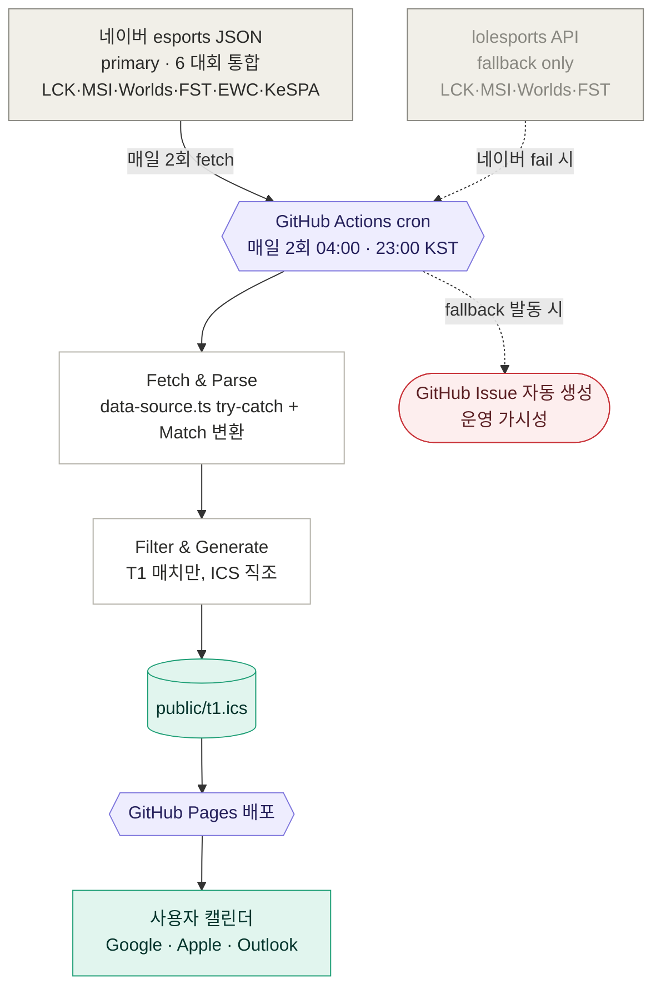
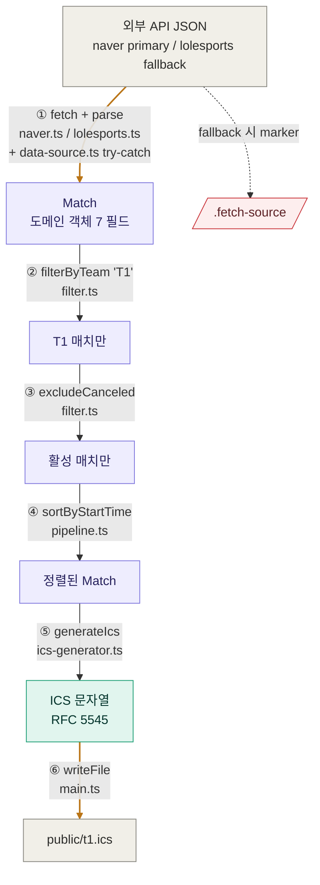

# LCK Schedule Sync — 아키텍처

> T1 팬을 위한 LCK·국제 대회 매치 일정 자동 동기화 시스템. 외부 API에서 받은 LoL 매치 데이터를 `t1.ics` 캘린더 파일로 변환·배포한다.
>
> 결정·로드맵·운영 모범사례는 [`CLAUDE.md`](./CLAUDE.md). 이 문서는 **시스템이 어떻게 굴러가나**에 집중.

## 1. 시스템 전체 흐름



회색 = 외부 시스템 / 보라 = 우리 인프라 / 흰색 = 파이프라인 / 청록 = 산출물·소비 / 빨강 = 운영 알람.

**트래픽 분리**: 사용자 1명이든 10000명이든 외부 API 호출은 매일 2회 고정 (사용자는 GitHub Pages에서 `.ics`만 받기 때문). 비영리 공개 가능한 구조 — 단계적 공개 전략·모범사례 8항목은 [CLAUDE.md "Phase 3 데이터 소스 전환 결정"](./CLAUDE.md) 참조.

**데이터 소스 전략 (Phase 3 완료)**: 네이버 단일 primary (6 대회 — LCK·MSI·Worlds·FST·EWC·KeSPA Cup) + lolesports fallback. 네이버가 한국어 자연 풍부 + 신규 대회(KeSPA·EWC) 커버, lolesports는 Phase 2 검증 코드를 fallback으로 재활용 (sunk cost 회피). 아시안 게임은 4년 주기·데이터 부재로 자동화 범위 외 (3차 결정). fallback 발동 시 GitHub Actions가 Issue 자동 생성으로 운영 가시성 확보.

---

## 2. 데이터 가공 파이프라인 (6단계)



호박색 화살표(①, ⑥)만 side effect. ②~⑤는 전부 순수 함수 → 91개 단위 테스트의 토대.

| #   | 단계                     | 순수?          | 파일 · 함수                                                                                            |
| --- | ------------------------ | -------------- | ------------------------------------------------------------------------------------------------------ |
| ①   | fetch + parse + fallback | ❌ side effect | `naver.ts:fetchAllNaverMatches` · `lolesports.ts:fetchAllMatches` · `data-source.ts:fetchWithFallback` |
| ②   | 팀 필터                  | ✅             | `filter.ts:filterByTeam`                                                                               |
| ③   | 취소 매치 제외           | ✅             | `filter.ts:excludeCanceled`                                                                            |
| ④   | 시작 시각 정렬           | ✅             | `pipeline.ts:sortByStartTime`                                                                          |
| ⑤   | ICS 직조                 | ✅             | `ics-generator.ts:generateIcs`                                                                         |
| ⑥   | 파일 쓰기 + marker       | ❌ side effect | `main.ts` — `public/t1.ics` + `.fetch-source` (fallback 감지용)                                        |

---

## 3. 핵심 변환 상세

### 3.1 ① parse + normalize — raw API → 도메인 7필드

가장 정보 손실이 큰 단계. 두 source가 각자 자신의 `toMatch` 안에 결정을 응축 → ②~⑥은 source 무관.

| 행위                                                    | lolesports                        | 네이버                                               | 비고                                                             |
| ------------------------------------------------------- | --------------------------------- | ---------------------------------------------------- | ---------------------------------------------------------------- |
| 타입 가드 (TBD, teams.length, 누락 필드 등) silent drop | `lolesports.ts:toMatch`           | `naver.ts:toMatch`                                   | 깨진 이벤트가 ICS까지 안 새지만 silent라 새 포맷은 모름          |
| 시간 정규화 → UTC ISO                                   | `startTime` 그대로 (이미 ISO UTC) | `new Date(startDate).toISOString()` (epoch ms → ISO) | KST 변환은 ⑤ 출력 시점까지 미룸 — 도메인 시간 한 가지 진실       |
| `bestOf` 1·3·5만 허용, 외는 drop                        | `normalizeBestOf`                 | `normalizeBestOf`                                    | Bo2·Bo7 silent drop — 회귀 테스트로 못 박음                      |
| status 정규화 (3값으로 축소)                            | `state` → `normalizeStatus`       | `matchStatus` → `normalizeStatus`                    | `scheduled` · `completed` · `canceled`                           |
| 한국어 팀 displayName                                   | `toKoreanTeamName` 매핑 필요      | `name` 그대로 (네이버는 한국어 자연 풍부)            | 캘린더 SUMMARY에 한국어 노출 ("GEN" → "젠지")                    |
| UID 멱등성 + namespace 분리                             | `match.id` 그대로                 | `naver:${gameId}` 접두                               | 두 source 매치 충돌 회피 (lolesports는 숫자 ID, 네이버는 영숫자) |

### 3.2 ⑤ generateIcs — RFC 5545 직조

| 변환                                   | 코드 위치                              | 비고                                                                                          |
| -------------------------------------- | -------------------------------------- | --------------------------------------------------------------------------------------------- |
| UTC ISO → KST (TZID 명시)              | `ics-generator.ts:formatKstCompact`    | `+9h` shift 트릭은 `toKstParts` 안에 격리                                                     |
| DTEND 추정 (Bo1=+1h·Bo3=+3h·Bo5=+4.5h) | `ics-generator.ts:estimateMatchEnd`    | API가 종료 시각 미제공 → 실측 기반 평균                                                       |
| VTIMEZONE 블록 명시                    | `ics-generator.ts:buildVTimezoneBlock` | TZID만 쓰면 Apple Calendar·Outlook 호환 불안 → 블록도 박음                                    |
| `escapeText` + `foldLine`              | `ics-generator.ts`                     | RFC 5545: 콤마·세미콜론·줄바꿈 escape + UTF-8 75바이트 라인 폴딩                              |
| UID = `${match.id}@lck-schedule-sync`  | `ics-generator.ts`                     | 멱등성 — 같은 매치 = 같은 UID → 캘린더 중복 없이 갱신. naver는 접두 `naver:`로 namespace 분리 |

**변환 예시** (Match → VEVENT 핵심 라인):

```
Match { startsAt: '2026-04-08T10:00:00Z', bestOf: 3 }
  ↓
DTSTART;TZID=Asia/Seoul:20260408T190000   ← UTC 10:00 → KST 19:00
DTEND;TZID=Asia/Seoul:20260408T220000     ← +3h (Bo3)
SUMMARY:T1 vs 젠지 — LCK 2026 Spring 2주 차 (Bo3)
```

---

## 4. 데이터 DTO

### 4.1 raw API DTO

#### lolesports `ScheduleEvent` (`src/lolesports.ts`)

```ts
interface ScheduleEvent {
  readonly startTime: string; // → DTSTART (UTC ISO)
  readonly state: string; // → STATUS
  readonly type: string; // 'match'만 통과
  readonly blockName?: string; // → tournament.stage ("2주 차", "결승")
  readonly league?: { readonly name?: string }; // → tournament.displayName
  readonly match?: {
    readonly id: string; // → UID (멱등성)
    readonly teams: readonly EventTeam[];
    readonly strategy?: { readonly count?: number }; // → bestOf
  };
}
```

#### 네이버 `NaverMatch` (`src/naver.ts`)

```ts
interface NaverMatch {
  readonly gameId: string; // → "naver:${gameId}" UID
  readonly topLeagueId: string; // → displayName 매핑 키 (응답 inline 없음)
  readonly title: string; // → tournament.stage ("정규시즌 1R", "스위스 3R")
  readonly startDate: number; // epoch ms (UTC) → ISO 8601 변환
  readonly maxMatchCount: number; // → bestOf
  readonly matchStatus: string; // "BEFORE" | "RESULT" | "CANCEL"
  readonly homeTeam: { readonly name: string; readonly nameEngAcronym: string } | null;
  readonly awayTeam: { readonly name: string; readonly nameEngAcronym: string } | null;
}
```

⚠️ **의식적으로 미사용**: 두 source 모두 결과(score · winner · record) 필드 무시 → **스포일러 회피**. 이미 본 매치가 캘린더에서 결과 노출되지 않도록.

⚠️ **displayName 출처 차이**: lolesports는 `league.name`이 응답 inline. 네이버는 inline 없음 → `NAVER_LEAGUE_DISPLAY_NAMES` 매핑 테이블이 `topLeagueId`로 주입. 6 대회 한정이라 단순.

### 4.2 Match — 도메인 객체

`src/core/types.ts`. 7 top-level 필드, 불변·`readonly` 강제. Phase 3에서 네이버 응답이 합류해도 이 모양이 변경 차단막.

```ts
interface Match {
  readonly id: string; // = raw match.id → ICS UID
  readonly tournament: {
    readonly displayName: string; // "LCK 2026 Spring"
    readonly stage: string; // "2주 차"
  };
  readonly teamA: Team;
  readonly teamB: Team;
  readonly startsAt: string; // ISO 8601 UTC
  readonly bestOf: 1 | 3 | 5;
  readonly status: 'scheduled' | 'completed' | 'canceled';
}

interface Team {
  readonly code: string; // "T1"
  readonly displayName: string; // "T1", "젠지" (한국어 매핑)
}
```

### 4.3 ICS VEVENT — 최종 출력

```
BEGIN:VEVENT
UID:115548128962840643@lck-schedule-sync
DTSTAMP:20260513T020000Z
DTSTART;TZID=Asia/Seoul:20260520T190000
DTEND;TZID=Asia/Seoul:20260520T220000
SUMMARY:T1 vs 젠지 — LCK 2026 Spring 2주 차 (Bo3)
DESCRIPTION:T1 vs 젠지\nLCK 2026 Spring — 2주 차\nBest of 3\n\n중계: https://lolesports.com/
STATUS:CONFIRMED
URL:https://lolesports.com/
END:VEVENT
```

### 4.4 iCalendar 구독 동기화 메커니즘

사용자가 `.ics` URL을 구독하면 캘린더 앱이 주기적으로 fetch해 자동 갱신. 핵심 매커니즘:

| 항목                  | 동작                                                                                                               |
| --------------------- | ------------------------------------------------------------------------------------------------------------------ |
| **Pull 모델**         | 캘린더 앱이 일정 주기로 `t1.ics` URL을 HTTP GET. push 없음                                                         |
| **UID 멱등성**        | lolesports `match.id` 또는 네이버 `gameId`를 ICS UID로 보존. 같은 UID = 같은 이벤트 → in-place 갱신 (중복 안 생성) |
| **HTTP 304 캐싱**     | GitHub Pages가 자동 처리. 변경 없으면 304 응답 → 캘린더 앱 트래픽 절약                                             |
| **fetch 주기 (앱별)** | Google Calendar: 12~24h (조정 불가) / Apple Calendar: 매시간 기본, 5분~1주 선택 가능 / Outlook: 사용자 설정        |
| **end-to-end lag**    | cron 12h (매일 2회 발행) + 캘린더 fetch 주기 평균 6h ≈ **평균 18시간**, 최대 36시간 (Google이 24h일 때)            |

⚠️ **Import vs Subscribe**: 사용자가 "import / 가져오기"로 추가하면 일회성 사본만 들어가 **UID 보존도 안 되고**(캘린더 앱이 자체 UUID 재발급) **자동 갱신도 안 됨**. 반드시 **URL 구독**을 사용해야 함 — README의 캘린더 앱별 절차 가이드 참조.

---

## 5. Phase 변경 면적 예측

설계 핵심: **②의 정보 압축이 한 곳에 모이고, `Match` 도메인이 데이터 소스 차단막** → 새 대회·새 데이터 소스 추가 시 변경 영역이 좁다.

### 5.1 Phase 2 (완료) — lolesports 확장 (MSI · Worlds · First Stand)

| 단계          | 변경?    | 내용                                                                 |
| ------------- | -------- | -------------------------------------------------------------------- |
| ① fetch       | **소폭** | `fetchAllMatches()` 헬퍼 — 4개 `leagueId` 순차 fetch + concat        |
| ② parse       | ❌ 없음  | DTO 동일 (CLAUDE.md "DTO 안정성" 7개 응답 비교 결과)                 |
| ③~⑤           | ❌ 없음  | 도메인 무관                                                          |
| ⑥ generateIcs | 0줄      | SUMMARY가 `tournament.displayName`로 자연 분기 — 코드 0, 출력만 다양 |
| ⑦ writeFile   | ❌ 없음  | 동일 경로                                                            |

→ **본질: ① 한 함수 추가**. Phase 1에서 DTO 안정성 미리 검증해둔 보상.

> **실측 (2026-05-13)**: 예측 그대로. `main.ts`만 3줄 추가 변경. T1 출전 48 매치(LCK 16·MSI 16·Worlds 16·First Stand 0) 정상 발행. 자세한 회고는 [CLAUDE.md "Phase 2 완료"](./CLAUDE.md).

### 5.2 Phase 3 (완료, 2026-05-13) — 네이버 esports primary + lolesports fallback

**전환 후 데이터 흐름**: primary는 네이버 (LCK·MSI·Worlds·FST·EWC·KeSPA 6 대회 통합 fetch — 6 league × 5 month = 30 호출/회 × 250ms throttle ≈ 8초). 네이버 실패 시 `data-source.ts:fetchWithFallback`이 try-catch로 격리해 `lolesports.ts` fallback 호출 (LCK·MSI·Worlds·FST만 — 신규 대회는 빈 결과로 자연 흐름). 아시안 게임은 4년 주기·데이터 부재로 자동화 범위 외 (3차 결정).

| 단계         | 실제 변경                                                                                                     |
| ------------ | ------------------------------------------------------------------------------------------------------------- |
| ① fetch      | `src/naver.ts:fetchAllNaverMatches` 신설 (primary, 3 과거 + 현재 + 1 미래 월 rolling = 5 month)               |
| ① parse      | `src/naver.ts:parseNaverResponse` + `toMatch` (UID 접두 `naver:` · `name` 한국어 그대로)                      |
| ① 합성       | `src/data-source.ts:fetchWithFallback` 신설 — primary throw 시 fallback 자동 호출, `{matches, source}` 반환   |
| `lolesports` | Phase 2 코드 그대로 보존 (`fetchAllMatches`) — fallback 역할로 강등 (sunk cost 회피)                          |
| 운영 가시성  | `main.ts`가 `.fetch-source` marker 작성 → `.github/workflows/publish.yml`이 fallback 감지 시 Issue 자동 생성  |
| 단위 테스트  | 91개 (+38 naver-parse, +5 data-source fallback)                                                               |
| 시각 검증    | `scripts/verify-phase-3.ts` — 6 대회 raw fixture 무필터 ICS (269 매치) 빌드, 캘린더 import로 한국어·시간 검증 |
| ②~⑥          | **0줄 변경** — 도메인이 `Match`로 통일된 결과                                                                 |

→ **본질**: 새 파일 2개 (`naver.ts`, `data-source.ts`) + `main.ts` 갱신 + 워크플로 step 2개. `Match` 도메인이 변경 차단막이라 ②~⑥은 한 줄도 안 건드림. ARCHITECTURE.md §5 예측 그대로.

→ **운영 lifecycle**: ICS는 매번 통째 덮어쓰기 → ICS에 빠진 UID는 캘린더에서 자동 삭제. 우리는 **5개월 rolling**(과거 3 + 현재 + 미래 1)로 fetch → T1 ~25 매치만 캘린더 유지, 4개월+ 전은 자동 정리. **캘린더 본질 = 다가오는 일정**에 집중 (추억 보존은 Phase 4 검토). 결정 진화는 [CLAUDE.md "Phase 3 lookback window 결정"](./CLAUDE.md) 5차 단계 참조.

→ **Phase 2 lolesports 코드 폐기 X**: 안정성 검증된 fetcher를 fallback으로 재활용 → sunk cost 회피 + 비공식 API 단독 의존 위험 흡수. fallback 발동은 Issue로 운영자 통보.

→ **Step C에서 추가로 발견된 사항**:

- 네이버 burst rate limit (429) 실측 발견 → 250ms throttle 추가
- 네이버 lead time 실측 ~1개월 (현재월+1 데이터만 등록) → 미래 fetch 1개월로 축소
- TBD 매치 269건 중 0건 — lolesports와 다르게 네이버는 미정 매치 응답에 포함 X (parser 분기 불필요)
