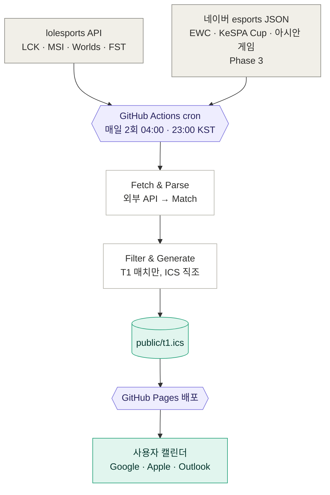
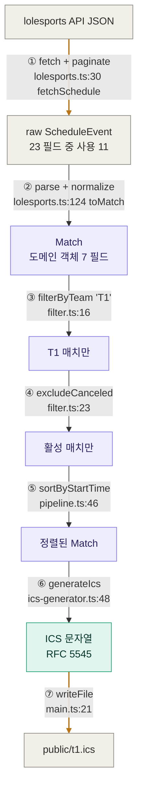

# LCK Schedule Sync — 아키텍처

> T1 팬을 위한 LCK·국제 대회 매치 일정 자동 동기화 시스템. 외부 API에서 받은 LoL 매치 데이터를 `t1.ics` 캘린더 파일로 변환·배포한다.
>
> 결정·로드맵·운영 모범사례는 [`CLAUDE.md`](./CLAUDE.md). 이 문서는 **시스템이 어떻게 굴러가나**에 집중.

## 1. 시스템 전체 흐름



회색 = 외부 시스템 / 보라 = 우리 인프라 / 흰색 = 파이프라인 / 청록 = 산출물·소비.

**트래픽 분리**: 사용자 1명이든 10000명이든 외부 API 호출은 매일 2회 고정 (사용자는 GitHub Pages에서 `.ics`만 받기 때문). 비영리 공개 가능한 구조 — 단계적 공개 전략·모범사례 8항목은 [CLAUDE.md "Phase 2 데이터 소스 결정"](./CLAUDE.md) 참조.

---

## 2. 데이터 가공 파이프라인 (7단계)



호박색 화살표(①, ⑦)만 side effect. ②~⑥은 전부 순수 함수 → 단위 테스트 38개의 토대.

| #   | 단계                     | 순수?          | 파일 · 함수                                             |
| --- | ------------------------ | -------------- | ------------------------------------------------------- |
| ①   | API fetch + 페이지네이션 | ❌ side effect | `lolesports.ts:30 fetchSchedule`                        |
| ②   | 파싱·정규화·드롭         | ✅             | `lolesports.ts:105 parseScheduleResponse → 124 toMatch` |
| ③   | 팀 필터                  | ✅             | `filter.ts:16 filterByTeam`                             |
| ④   | 취소 매치 제외           | ✅             | `filter.ts:23 excludeCanceled`                          |
| ⑤   | 시작 시각 정렬           | ✅             | `pipeline.ts:46 sortByStartTime`                        |
| ⑥   | ICS 직조                 | ✅             | `ics-generator.ts:48 generateIcs`                       |
| ⑦   | 파일 쓰기                | ❌ side effect | `main.ts:21 main`                                       |

---

## 3. 핵심 변환 상세

### 3.1 ② parse + normalize — raw 23필드 → 도메인 7필드

가장 정보 손실이 큰 단계. 결정이 `toMatch` 안에 다 모임 → Phase 2 확장 시 변경 0줄의 근거.

| 행위                                                                     | 코드 위치                           | 비고                                                         |
| ------------------------------------------------------------------------ | ----------------------------------- | ------------------------------------------------------------ |
| 타입 가드 6개 (`type!=='match'`, TBD, `teams.length!==2` 등) silent drop | `lolesports.ts:125-135`             | 깨진 이벤트가 ICS까지 안 새지만 silent라 새 포맷 흘러도 모름 |
| 시간은 UTC ISO 그대로 보존                                               | `lolesports.ts:151`                 | KST 변환은 ⑥ 출력 시점까지 미룸 — 도메인 시간 한 가지 진실   |
| `bestOf` 1·3·5만 허용, 외는 drop                                         | `lolesports.ts:157 normalizeBestOf` | Bo2·Bo7 silent drop — 회귀 테스트로 못 박음                  |
| `state` → `status` 정규화 (3값으로 축소)                                 | `lolesports.ts:162 normalizeStatus` | `scheduled` · `completed` · `canceled`                       |
| 영문 코드·이름 → 한국어 displayName                                      | `toKoreanTeamName`                  | 캘린더 SUMMARY에 한국어 노출 ("GEN" → "젠지")                |

### 3.2 ⑥ generateIcs — RFC 5545 직조

| 변환                                   | 코드 위치                                 | 비고                                                             |
| -------------------------------------- | ----------------------------------------- | ---------------------------------------------------------------- |
| UTC ISO → KST (TZID 명시)              | `ics-generator.ts:165 formatKstCompact`   | `+9h` shift 트릭은 `toKstParts:177` 안에 격리                    |
| DTEND 추정 (Bo1=+1h·Bo3=+3h·Bo5=+4.5h) | `ics-generator.ts:147 estimateMatchEnd`   | API가 종료 시각 미제공 → 실측 기반 평균                          |
| VTIMEZONE 블록 명시                    | `ics-generator.ts:79 buildVTimezoneBlock` | TZID만 쓰면 Apple Calendar·Outlook 호환 불안 → 블록도 박음       |
| `escapeText` + `foldLine`              | `:206, :223`                              | RFC 5545: 콤마·세미콜론·줄바꿈 escape + UTF-8 75바이트 라인 폴딩 |
| UID = `match.id@lck-schedule-sync`     | `:106`                                    | 멱등성 — 같은 매치 = 같은 UID → 캘린더 중복 없이 갱신            |

**변환 예시** (Match → VEVENT 핵심 라인):

```
Match { startsAt: '2026-04-08T10:00:00Z', bestOf: 3 }
  ↓
DTSTART;TZID=Asia/Seoul:20260408T190000   ← UTC 10:00 → KST 19:00
DTEND;TZID=Asia/Seoul:20260408T220000     ← +3h (Bo3)
SUMMARY:T1 vs 젠지 — LCK 2026 Spring 2주 차 (Bo3)
```

---

## 4. 데이터 DTO

### 4.1 ScheduleEvent (raw API, lolesports)

`src/lolesports.ts:76-93`. lolesports가 우리에게 주는 모양 (사용 11필드만 추림):

```ts
interface ScheduleEvent {
  readonly startTime: string; // → DTSTART (UTC ISO)
  readonly state: string; // → STATUS
  readonly type: string; // 'match'만 통과
  readonly blockName?: string; // → tournament.stage ("2주 차", "결승")
  readonly league?: { readonly name?: string }; // → tournament.displayName
  readonly match?: {
    readonly id: string; // → UID (멱등성)
    readonly teams: readonly EventTeam[];
    readonly strategy?: { readonly count?: number }; // → bestOf
  };
}
```

⚠️ **의식적으로 미사용**: `record.{wins,losses}` + `result.{outcome,gameWins}` — 스포일러 회피. 이미 본 매치가 캘린더에서 결과 노출되지 않도록.

### 4.2 Match — 도메인 객체

`src/core/types.ts`. 7 top-level 필드, 불변·`readonly` 강제. Phase 3에서 네이버 응답이 합류해도 이 모양이 변경 차단막.

```ts
interface Match {
  readonly id: string; // = raw match.id → ICS UID
  readonly tournament: {
    readonly displayName: string; // "LCK 2026 Spring"
    readonly stage: string; // "2주 차"
  };
  readonly teamA: Team;
  readonly teamB: Team;
  readonly startsAt: string; // ISO 8601 UTC
  readonly bestOf: 1 | 3 | 5;
  readonly status: 'scheduled' | 'completed' | 'canceled';
}

interface Team {
  readonly code: string; // "T1"
  readonly displayName: string; // "T1", "젠지" (한국어 매핑)
}
```

### 4.3 ICS VEVENT — 최종 출력

```
BEGIN:VEVENT
UID:115548128962840643@lck-schedule-sync
DTSTAMP:20260513T020000Z
DTSTART;TZID=Asia/Seoul:20260520T190000
DTEND;TZID=Asia/Seoul:20260520T220000
SUMMARY:T1 vs 젠지 — LCK 2026 Spring 2주 차 (Bo3)
DESCRIPTION:T1 vs 젠지\nLCK 2026 Spring — 2주 차\nBest of 3\n\n중계: https://lolesports.com/
STATUS:CONFIRMED
URL:https://lolesports.com/
END:VEVENT
```

---

## 5. Phase 변경 면적 예측

설계 핵심: **②의 정보 압축이 한 곳에 모이고, `Match` 도메인이 데이터 소스 차단막** → 새 대회·새 데이터 소스 추가 시 변경 영역이 좁다.

### 5.1 Phase 2 (완료) — lolesports 확장 (MSI · Worlds · First Stand)

| 단계          | 변경?    | 내용                                                                 |
| ------------- | -------- | -------------------------------------------------------------------- |
| ① fetch       | **소폭** | `fetchAllMatches()` 헬퍼 — 4개 `leagueId` 순차 fetch + concat        |
| ② parse       | ❌ 없음  | DTO 동일 (CLAUDE.md "DTO 안정성" 7개 응답 비교 결과)                 |
| ③~⑤           | ❌ 없음  | 도메인 무관                                                          |
| ⑥ generateIcs | 0줄      | SUMMARY가 `tournament.displayName`로 자연 분기 — 코드 0, 출력만 다양 |
| ⑦ writeFile   | ❌ 없음  | 동일 경로                                                            |

→ **본질: ① 한 함수 추가**. Phase 1에서 DTO 안정성 미리 검증해둔 보상.

> **실측 (2026-05-13)**: 예측 그대로. `main.ts`만 3줄 추가 변경. T1 출전 48 매치(LCK 16·MSI 16·Worlds 16·First Stand 0) 정상 발행. 자세한 회고는 [CLAUDE.md "Phase 2 완료"](./CLAUDE.md).

### 5.2 Phase 3 (다음) — 네이버 esports JSON API 추가 (EWC · KeSPA Cup · 아시안 게임)

| 단계    | 변경?    | 내용                                                               |
| ------- | -------- | ------------------------------------------------------------------ |
| ① fetch | **변경** | `naver-esports.ts:fetchNaverSchedule()` 신설                       |
| ② parse | **변경** | `naver-esports.ts:toMatchFromNaver()` 신설 — 네이버 응답 → `Match` |
| ③~⑦     | ❌ 없음  | 도메인이 `Match`로 통일됐기 때문                                   |

→ **본질: ①·② 두 함수 추가**. UID 충돌 회피 위해 네이버 매치는 `naver:<gameId>@lck-schedule-sync` 접두 권장 (구현 시점에 확정).
