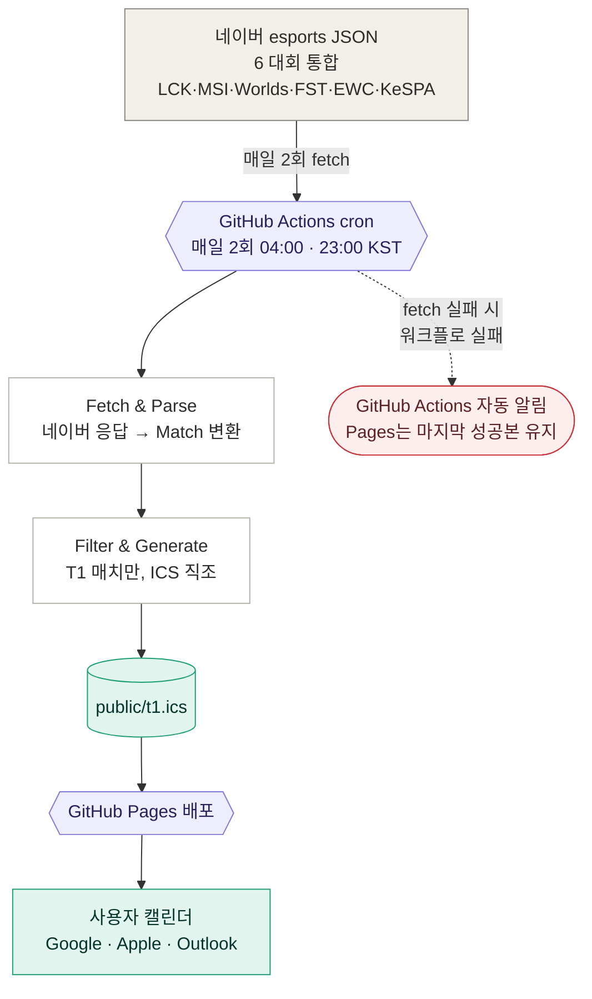

# LCK Teams Schedule — 아키텍처

> LCK 팬을 위한 LCK·국제 대회 매치 일정 자동 동기화 시스템. 외부 API에서 받은 LoL 매치 데이터를 LCK 10팀별 `.ics` 캘린더 파일로 변환·배포한다.
>
> 결정·로드맵·운영 모범사례는 [`CLAUDE.md`](./CLAUDE.md)·[`DECISION_MAKING.md`](./DECISION_MAKING.md). 이 문서는 **시스템이 어떻게 굴러가나**에 집중.

## 1. 시스템 전체 흐름



회색 = 외부 시스템 / 보라 = 우리 인프라 / 흰색 = 파이프라인 / 청록 = 산출물·소비 / 빨강 = 운영 알람.

**트래픽 분리**: 사용자 1명이든 10000명이든 외부 API 호출은 매일 2회 고정 (사용자는 GitHub Pages에서 `.ics`만 받기 때문). 비영리 공개 가능한 구조 — 단계적 공개 전략·모범사례는 [CLAUDE.md "Phase 3 데이터 소스 전환 결정"](./CLAUDE.md) 참조.

**데이터 소스 전략 (Phase 3 완료)**: 네이버 esports JSON API 단일 소스 (6 대회 — LCK·MSI·Worlds·FST·EWC·KeSPA Cup). 한국어 자연 풍부 + KeSPA·EWC 커버. 아시안 게임은 4년 주기·데이터 부재로 자동화 범위 외.

**실패 시 정책**: 네이버 호출이 throw하면 `main()`이 그대로 propagate → `process.exit(1)` → GitHub Actions 워크플로 실패. 기존 `public/t1.ics`는 갱신되지 않으므로 GitHub Pages는 **마지막 성공본을 계속 서빙** → 사용자 캘린더의 기존 매치는 유지, 신규 매치만 다음 cron(최대 12h 뒤)까지 lag. 자세한 정책 결정 흐름은 [CLAUDE.md "Phase 3 데이터 소스 전환 결정"](./CLAUDE.md) 참조.

---

## 2. 데이터 가공 파이프라인 (4단계)

```mermaid
flowchart TD
    rawJson[네이버 esports JSON]
    rawJson -->|"① fetch + parse<br/>naver.ts"| matches[Match<br/>도메인 클래스 (8 필드 + 게터)]
    matches -->|"② inline filter<br/>main.ts: involves + isActive"| active[T1 활성 매치만]
    active -->|"③ generateIcs (sort 내장)<br/>ics.ts"| ics[ICS 문자열<br/>RFC 5545 UTC]
    ics -->|"④ writeFile<br/>main.ts"| output[public/t1.ics]

    style rawJson fill:#F1EFE8,stroke:#888780,color:#2C2C2A
    style matches fill:#EEEDFE,stroke:#7F77DD,color:#26215C
    style active fill:#EEEDFE,stroke:#7F77DD,color:#26215C
    style ics fill:#E1F5EE,stroke:#1D9E75,color:#04342C
    style output fill:#F1EFE8,stroke:#888780,color:#2C2C2A

    linkStyle 0 stroke:#BA7517,stroke-width:2px
    linkStyle 3 stroke:#BA7517,stroke-width:2px
```

호박색 화살표(①, ④)만 side effect. ②~③은 전부 순수 → 단위 테스트의 토대.

| #   | 단계                      | 순수?          | 파일 · 함수                                         |
| --- | ------------------------- | -------------- | --------------------------------------------------- |
| ①   | fetch + parse             | ❌ side effect | `naver.ts:fetchAllMatches`                          |
| ②   | 팀 활성 매치 선별         | ✅             | `main.ts` 인라인 (`m.involves(code) && m.isActive`) |
| ③   | ICS 직조 (시작 시각 정렬) | ✅             | `ics.ts:generateIcs`                                |
| ④   | 파일 쓰기                 | ❌ side effect | `main.ts` — `public/t1.ics` 출력                    |

---

## 3. 핵심 변환 상세

### 3.1 ① parse + normalize — raw API → 도메인 Match

가장 정보 손실이 큰 단계. `naver.ts:toMatch`의 zod safeParse + 가드에 결정을 응축 → ②~④는 source 무관 (다른 소스로 전환할 일이 생겨도 ②~④는 그대로).

| 행위                                                    | 처리 위치                                                                |
| ------------------------------------------------------- | ------------------------------------------------------------------------ |
| 타입 가드 (TBD, teams.length, 누락 필드 등) silent drop | `naver.ts:toMatch` (zod safeParse + null 분기)                           |
| 시간 정규화 → UTC ISO                                   | `naver.ts:epochMsToIsoUtc` (epoch ms → ISO)                              |
| `bestOf` 1·3·5만 허용, 외는 throw                       | `match.ts:assertBestOf` (Bo2·Bo7 등 계약 위반 → throw)                   |
| status 정규화 (3값으로 축소)                            | `matchStatus` → `toMatchStatus` (`scheduled` · `completed` · `canceled`) |
| 한국어 팀 displayName                                   | LCK 팀은 도메인 표준(`LCK_TEAM_DISPLAY_NAME`), 그 외 네이버 값 그대로    |
| UID 멱등성 + namespace                                  | `naver:${gameId}` 접두 (소스 전환 시 충돌 회피용 namespace)              |

### 3.2 ③ generateIcs — RFC 5545 직조 (시작 시각 정렬 내장)

| 변환                                                    | 코드 위치                                    | 비고                                                                              |
| ------------------------------------------------------- | -------------------------------------------- | --------------------------------------------------------------------------------- |
| UTC compact 출력 (`Z` suffix)                           | `utc-compact.ts:formatUtcCompact`            | 캘린더 앱이 사용자 로컬 timezone으로 자동 변환 (TZID·VTIMEZONE 불필요)            |
| DTEND 추정 (Bo\* × 30분: Bo1=+30분·Bo3=+1.5h·Bo5=+2.5h) | `match.ts:Match.endDate` (게터)              | 도메인 응집 — API가 종료 시각 미제공 → "한 게임 ≈ 30분" 가정                      |
| DTSTAMP = now (RFC §3.8.7.2)                            | `main.ts`가 빌드 시점 주입                   | 직렬화 시각, 매 발행 변동 — 변경 신호는 SEQUENCE로 분리 (DECISION_MAKING §4.8)    |
| CREATED · LAST-MODIFIED · SEQUENCE                      | `ics.ts:matchToVeventLines` + `sync-meta.ts` | 콘텐츠 변경 시에만 +1·now (이전 ICS의 X-CONTENT-HASH read해 매치별 diff)          |
| SUMMARY · DESCRIPTION 본문                              | `match.ts:summary` / `.description` (게터)   | 도메인 표현 응집 — ics.ts는 형식화만                                              |
| `escapeText` + `foldLine`                               | `ics.ts`                                     | RFC 5545: 콤마·세미콜론·줄바꿈 escape + UTF-8 75바이트 라인 폴딩 (URL-aware fold) |
| UID = `${match.id}@lck-teams-schedule`                  | `ics.ts:uidOf`                               | 멱등성 — 같은 매치 = 같은 UID → 캘린더 중복 없이 갱신                             |

**변환 예시** (Match → VEVENT 핵심 라인, 완료 매치):

```
Match { startsAt: '2026-04-08T10:00:00Z', bestOf: 3, status: 'completed', ... }
  ↓
DTSTAMP:20260518T014615Z       ← now (RFC 정의, 매 발행 변동)
CREATED:20260408T100000Z       ← startDate (deterministic, 영구 동일)
LAST-MODIFIED:20260518T014615Z ← 콘텐츠 변경 시각 (변경 없으면 이전값 유지)
SEQUENCE:1                     ← 콘텐츠 변경 카운트
DTSTART:20260408T100000Z       ← UTC compact
DTEND:20260408T113000Z         ← +90분 (Bo3 × 30분)
SUMMARY:[LCK] T1 vs 젠지       ← short code + matchup만
DESCRIPTION:🎯 플레이오프 2R\n🎮 Bo3 (3판 2선승제)\n🏆 경기 결과: 1 vs 3 (젠지 승)\n🎬 다시보기: ...
```

---

## 4. 데이터 DTO

### 4.1 raw API DTO — 네이버 `NaverMatch` (`src/naver.ts`)

```ts
interface NaverMatch {
  readonly gameId: string; // → "naver:${gameId}" UID
  readonly topLeagueId: string; // → League enum 매핑 키 (응답 inline 없음)
  readonly title: string; // → stage ("정규시즌 1R", "플레이오프 2R", "Road to EWC")
  readonly startDate: number; // epoch ms (UTC) → ISO 8601 변환
  readonly maxMatchCount: number; // → bestOf
  readonly matchStatus: string; // "BEFORE" | "RESULT" | "CANCEL"
  readonly homeTeam: { readonly name: string; readonly nameEngAcronym: string } | null;
  readonly awayTeam: { readonly name: string; readonly nameEngAcronym: string } | null;
  // 매치 메타 (Phase 4)
  readonly homeScore?: number | null;
  readonly awayScore?: number | null;
  readonly winner?: 'HOME' | 'AWAY' | 'NONE' | null;
  readonly stadium?: string | null;
  readonly chzzkChannelId?: string | null;
  readonly replayVideoId?: number | null;
}
```

⚠️ **매치 메타 포함 (Phase 4)**: 점수·승자·경기장·치지직 채널·다시보기 ID 모두 사용 — 이전 스포일러 회피 정책 폐기 (DECISION_MAKING §4.7).

⚠️ **League 매핑**: `NAVER_TO_LEAGUE` (`src/naver.ts`)이 `topLeagueId` → 도메인 `League` enum 변환. 6 대회 닫힌 집합. displayName은 `LEAGUE_DISPLAY_NAME`·`LEAGUE_SHORT_CODE` (`src/league.ts`)에서.

### 4.2 Match — 도메인 클래스

`src/match.ts`. 12 readonly 필드(8 핵심 + 4 매치 메타) + 도메인 술어·표현 게터. 소스가 바뀌어도 이 모양이 변경 차단막.

```ts
class Match {
  readonly id: string; // = "naver:<gameId>" → ICS UID
  readonly league: League; // "LCK" · "MSI" · "WORLDS" · ... (도메인 enum)
  readonly stage: string; // "정규시즌 2R" (네이버 raw 그대로)
  readonly teamA: Team;
  readonly teamB: Team;
  readonly startsAt: string; // ISO 8601 UTC
  readonly bestOf: 1 | 3 | 5;
  readonly status: 'scheduled' | 'completed' | 'canceled';
  // 매치 메타 (Phase 4, optional)
  readonly score?: MatchScore; // { home, away, winner } — 완료 매치만
  readonly stadium?: string;
  readonly chzzkChannelId?: string;
  readonly replayVideoId?: number;

  // 도메인 술어
  get isActive(): boolean;
  involves(teamCode: string): boolean;

  // 도메인 표현 (ICS 출력에 사용)
  get startDate(): Date;
  get endDate(): Date; // startDate + Bo* × 30분
  get summary(): string; // "[LCK] T1 vs 젠지" — short code + matchup
  get description(): string; // 🎯 stage / 🎮 BoN / 🏆 결과 / 📺·🎬 시청 (이모지 일관)
  get location(): string | undefined; // ICS LOCATION 필드 (캘린더 앱 Maps 연동)
  get url(): string | null; // 완료=VOD, 예정=치지직 라이브
}

interface Team {
  readonly code: string; // "T1" (nameEngAcronym 또는 LckTeamCode)
  readonly displayName: string; // "T1", "젠지" (LCK 팀은 도메인 표준 우선)
}
```

### 4.3 ICS VEVENT — 최종 출력 (Phase 4 후속 3 형식)

```
BEGIN:VEVENT
UID:naver:2026050117ii8PCnB4429lol@lck-teams-schedule
DTSTAMP:20260518T014615Z       ← now (RFC §3.8.7.2 정의, 매 발행 변동)
CREATED:20260520T100000Z       ← startDate (deterministic)
LAST-MODIFIED:20260518T014615Z ← 콘텐츠 변경 시각
SEQUENCE:1                     ← 콘텐츠 변경 카운트 (DECISION_MAKING §4.8)
DTSTART:20260520T100000Z
DTEND:20260520T113000Z         ← Bo3 = +90분
SUMMARY:[LCK] T1 vs 젠지
LOCATION:치지직 롤파크          ← 캘린더 앱이 자체 영역에 표시
DESCRIPTION:🎯 정규시즌 2R\n🎮 Bo3 (3판 2선승제)\n🏆 경기 결과: 2 vs 0 (T1 승)\n🎬 다시보기: https://game.naver.com/.../999
STATUS:CONFIRMED
URL:https://game.naver.com/esports/League_of_Legends/videos/999
X-CONTENT-HASH:84544cf3...4c46 ← 다음 빌드 diff 복원용 (비표준 X-property)
END:VEVENT
```

모든 시각이 UTC compact (`Z` suffix) — 캘린더 앱이 사용자 로컬 timezone으로 자동 변환.

**VCALENDAR 헤더 (요약)**: `VERSION:2.0` · `PRODID` · `CALSCALE:GREGORIAN` · `METHOD:PUBLISH` + `NAME`(RFC 7986) · `X-WR-CALNAME` · `REFRESH-INTERVAL;VALUE=DURATION:PT12H` · `X-PUBLISHED-TTL:PT12H` (cron 12h 정합).

### 4.4 iCalendar 구독 동기화 메커니즘

사용자가 `.ics` URL을 구독하면 캘린더 앱이 주기적으로 fetch해 자동 갱신. 핵심 매커니즘:

| 항목                  | 동작                                                                                                        |
| --------------------- | ----------------------------------------------------------------------------------------------------------- |
| **Pull 모델**         | 캘린더 앱이 일정 주기로 `t1.ics` URL을 HTTP GET. push 없음                                                  |
| **UID 멱등성**        | 네이버 `gameId`를 `naver:` 접두로 보존. 같은 UID = 같은 이벤트 → in-place 갱신 (중복 안 생성)               |
| **HTTP 304 캐싱**     | GitHub Pages가 자동 처리. 변경 없으면 304 응답 → 캘린더 앱 트래픽 절약                                      |
| **fetch 주기 (앱별)** | Google Calendar: 12~24h (조정 불가) / Apple Calendar: 매시간 기본, 5분~1주 선택 가능 / Outlook: 사용자 설정 |
| **end-to-end lag**    | cron 12h (매일 2회 발행) + 캘린더 fetch 주기 평균 6h ≈ **평균 18시간**, 최대 36시간 (Google이 24h일 때)     |

⚠️ **Import vs Subscribe**: 사용자가 "import / 가져오기"로 추가하면 일회성 사본만 들어가 **UID 보존도 안 되고**(캘린더 앱이 자체 UUID 재발급) **자동 갱신도 안 됨**. 반드시 **URL 구독**을 사용해야 함 — README의 캘린더 앱별 절차 가이드 참조.

⚠️ **ICS lifecycle (UID 안정성의 양면)**: 새 ICS에 빠진 UID는 캘린더에서 **자동 삭제**됨. 따라서 fetcher를 다른 소스로 갈아끼우면 UID 네임스페이스가 통째 바뀌어 캘린더가 "전체 삭제 + 전체 재추가"로 인식 → 시각적 flapping + 캘린더 단위 기본 알림이 같은 매치에 재발화 가능. (참고: ICS `METHOD:PUBLISH` 구독은 RFC 5546상 read-only라 이벤트별 메모·색·알림 설정 자체가 불가 → 그 부분 손실은 없음.) 더해서 fallback 소스가 일부 대회를 미커버하면(우리 경우 lolesports는 KeSPA·EWC 부재) 그 매치들이 통째 사라짐. 두 항목으로 **소스 일관성**이 가짜 안전망보다 중요. fallback 패턴을 두지 않는 결정의 핵심 근거 (CLAUDE.md "Phase 3 데이터 소스 전환 결정" 4차 단계 참조).

---

## 5. Phase 변경 면적 예측

설계 핵심: **②의 정보 압축이 한 곳에 모이고, `Match` 도메인이 데이터 소스 차단막** → 새 대회·새 데이터 소스 추가 시 변경 영역이 좁다.

### 5.1 Phase 2 (완료) — lolesports 확장 (MSI · Worlds · First Stand)

| 단계          | 변경?    | 내용                                                                 |
| ------------- | -------- | -------------------------------------------------------------------- |
| ① fetch       | **소폭** | `fetchAllMatches()` 헬퍼 — 4개 `leagueId` 순차 fetch + concat        |
| ② parse       | ❌ 없음  | DTO 동일 (CLAUDE.md "DTO 안정성" 7개 응답 비교 결과)                 |
| ③~⑤           | ❌ 없음  | 도메인 무관                                                          |
| ⑥ generateIcs | 0줄      | SUMMARY가 `tournament.displayName`로 자연 분기 — 코드 0, 출력만 다양 |
| ⑦ writeFile   | ❌ 없음  | 동일 경로                                                            |

→ **본질: ① 한 함수 추가**. Phase 1에서 DTO 안정성 미리 검증해둔 보상.

> **실측 (2026-05-13)**: 예측 그대로. `main.ts`만 3줄 추가 변경. T1 출전 48 매치(LCK 16·MSI 16·Worlds 16·First Stand 0) 정상 발행. 자세한 회고는 [CLAUDE.md "Phase 2 완료"](./CLAUDE.md).

### 5.2 Phase 3 (완료) — 네이버 esports 단일 소스 전환

**전환 후 데이터 흐름**: 네이버 단일 소스 (LCK·MSI·Worlds·FST·EWC·KeSPA 6 대회 통합 fetch — 6 league × 5 month = 30 호출/회 × 250ms throttle ≈ 8초). 아시안 게임은 4년 주기·데이터 부재로 자동화 범위 외.

| 단계      | 실제 변경                                                                                          |
| --------- | -------------------------------------------------------------------------------------------------- |
| ① fetch   | `src/naver.ts:fetchAllNaverMatches` 신설 (3 과거 + 현재 + 1 미래 월 rolling = 5 month)             |
| ① parse   | `src/naver.ts:parseNaverResponse` + `toMatch` (UID 접두 `naver:` · `name` 한국어 그대로)           |
| 시각 검증 | `scripts/verify-phase-3.ts` — 6 대회 raw fixture 무필터 ICS 빌드, 캘린더 import로 한국어·시간 검증 |
| ②~⑥       | **0줄 변경** — 도메인이 `Match`로 통일된 결과                                                      |

→ **본질**: 새 파일 1개 (`naver.ts`) + `main.ts` 갱신. `Match` 도메인이 변경 차단막이라 ②~⑥은 한 줄도 안 건드림.

→ **운영 lifecycle**: ICS는 매번 통째 덮어쓰기 → ICS에 빠진 UID는 캘린더에서 자동 삭제. 우리는 **5개월 rolling**(과거 3 + 현재 + 미래 1)로 fetch → T1 ~25 매치만 캘린더 유지, 4개월+ 전은 자동 정리. **캘린더 본질 = 다가오는 일정**에 집중 (추억 보존은 Phase 4 검토). 결정 진화는 [CLAUDE.md "Phase 3 lookback window 결정"](./CLAUDE.md) 5차 단계 참조.

→ **lolesports 코드 폐기 이유**: 초기엔 fallback으로 보존했으나 (a) 두 소스의 UID 네임스페이스 차이로 fallback 발동 시 캘린더 전체가 "삭제 + 재추가"로 동작해 사용자 메모·알림 손실, (b) lolesports는 KeSPA·EWC 미커버라 fallback 발동 시 그 대회들이 일시 사라짐 — 안전망이 아니라 트랩. 네이버 fail은 워크플로 실패로 정직히 알리고, GitHub Pages가 마지막 성공본을 서빙하는 것으로 충분 (사용자 캘린더 안정성 ≫ 신규 매치 12h 단축). 자세한 의사결정 흐름은 CLAUDE.md "Phase 3 데이터 소스 전환 결정" 참조.

→ **Step C 실측 발견**:

- 네이버 burst rate limit (429) 발견 → 250ms throttle 추가
- 네이버 lead time ~1개월 (현재월+1 데이터만 등록) → 미래 fetch 1개월로 축소
- TBD 매치 fixture 269건 중 0건 — 네이버는 미정 매치 응답에 포함 X (parser 분기 불필요)

### 5.3 Phase 4 (진행 중) — 10팀 다중 발행 + 매치 메타 풍부화 + 동기화 메타 정합 + SUMMARY/DESC 재설계

| 항목                            | 변경                                                                                                                       |
| ------------------------------- | -------------------------------------------------------------------------------------------------------------------------- |
| **10팀 다중 발행**              | `main.ts`에 `LCK_TEAMS` loop 1개 + `landing.ts` 신규 (팀 선택 UI). 단일 fetch → 10팀 filter (네이버 호출 부담 무증가)      |
| **매치 메타 풍부화** (§4.7)     | `Match`에 score·stadium·chzzkChannelId·replayVideoId optional 필드 추가. `description` 게터가 status별 슬롯 조립           |
| **동기화 메타 RFC 정합** (§4.8) | `src/sync-meta.ts` 신규 — 이전 ICS의 X-CONTENT-HASH read → SHA-256 diff → SEQUENCE·LAST-MODIFIED 결정                      |
| **SUMMARY/DESC 재설계** (§4.9)  | `LEAGUE_SHORT_CODE` 신규, SUMMARY `[LCK] matchup`, DESC 이모지 일관 (🎯·🎮·🏆·📺·🎬)                                       |
| **SRP 리팩토링**                | `landing.ts` 거대 함수 분리(STYLES·GUIDE_PANEL·SCRIPT 상수), 팀 변환 로직 `naver.ts → team.ts` 응집, `utc-compact.ts` 신규 |

→ **본질**: 도메인 narrow waist 보상으로 ②~⑤ 무변경. `Match` 도메인 응집 + `sync-meta.ts`·`utc-compact.ts` 신규 모듈로 SRP 강화. 각 후속 결정의 *문제·근거·한계*는 DECISION_MAKING.md §4.7·§4.8·§4.9 참조.
